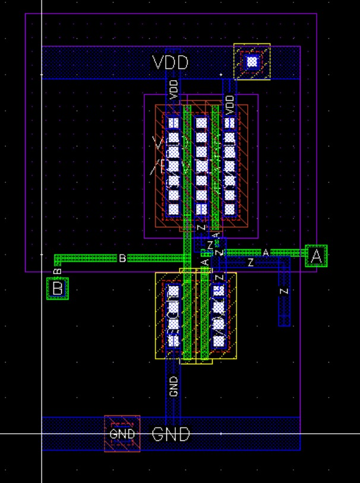
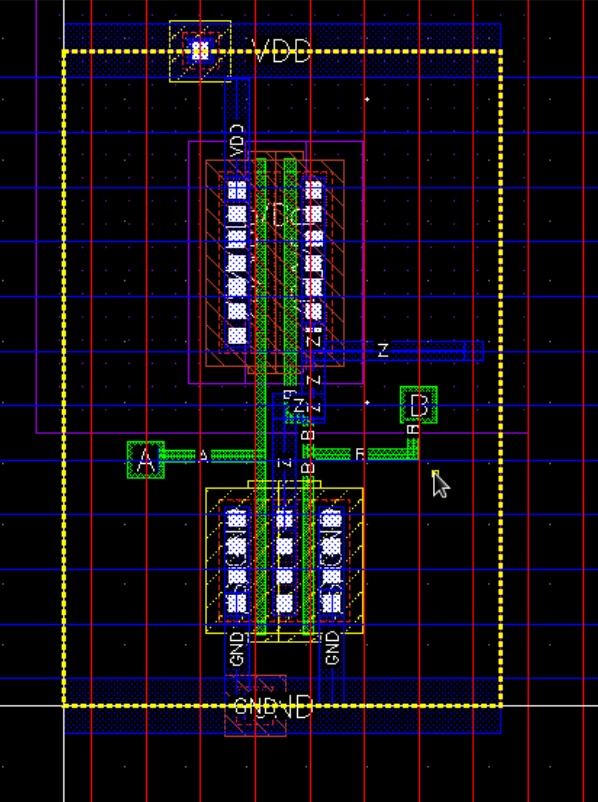
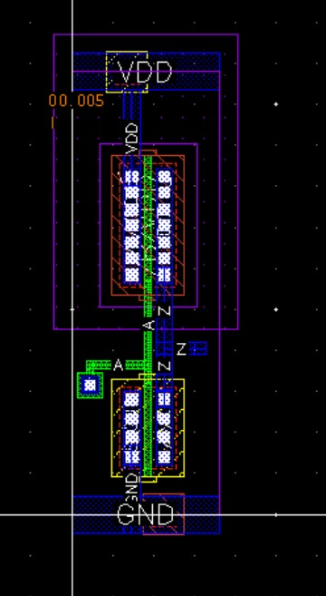

# Standard Cell Layout Design of Logic Gates

This project presents the **standard cell layout design** of fundamental logic gates using **MOSFETs in Cadence Virtuoso** GPDK_180 nm technology
The designs were validated using **Assura checks and DRC** to ensure correctness and compliance with layout rules.  

---

## 📘 Overview
Standard cells are the backbone of modern digital VLSI design.  
In this project, standard cells were designed for:
- **AND Gate**
- **OR Gate**
- **NOT Gate**

Each layout includes:
- PMOS and NMOS transistors  
- Metal routing and interconnections  
- Input and output pins (A, B, Z)  
- Power rails (**VDD** and **GND**)  

All layouts were verified using **Design Rule Check (DRC)** and **Layout Versus Schematic (LVS)** with **Assura** to ensure accuracy.  

---

## 🖼️ Layout Images

### 🔹 AND Gate

---

### 🔹 OR Gate

---

### 🔹 NOT Gate

---

## ⚡ Features
- MOSFET-level implementation  
- Cadence Virtuoso standard cell methodology  
- Power rails (VDD & GND) clearly defined  
- Inputs and outputs labeled  
- Verified with **Assura DRC**  

---
